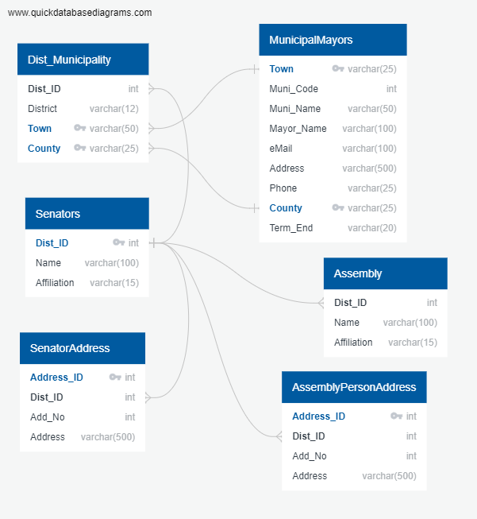
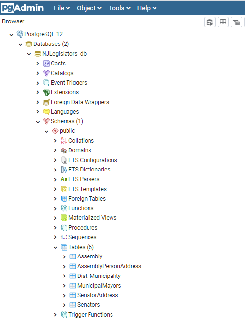

# NJ Legislators - Know Your NJ State Legislators

### Background:

New Jersey is divided into 21 counties and contains 565 municipalities consisting of five types: 254 boroughs, 52 cities, 15 towns, 241 townships, and 3 villages. These 565 municipalities are further divided in 40 New Jersey State legislative districts.

### Legislative Structure:

* NJ Federal Legislators: The state of New Jersey has two senators in the United States Senate and 12 representatives in the United States House of Representatives.

* NJ State Legislature: Consists of two Houses: a 40-member Senate and an 80-member General Assembly. The Senate and Assembly chambers are located in the State House in Trenton.

* NJ Counties Legislators: New Jersey's 21 counties elect freeholder that represent all towns within the county and elected at large. 

* NJ Township Legislators: NJ 565 municipalities follow different form of government and elect or select Mayor for the Township. Some township consists of various small towns. Towns has established their form of government that includes ward system and or council at large etc. The Executive Branch (the Mayor and Local agencies) carries out the programs established by law. Council is the local legislative body of the township.

## Purpose:

Most of us heard about elected officials but often do not know who they are and how to reach them. General public does not understand terms like congressional districts, state legislative districts, township districts and so on. The purpose of this short project is to link the State legislators with local townships that will enable to find out our state and local elected leaders are. 

### ETL Project:

#### Scope:
* Information gathering about NJ State legislators and Mayor - Head of local Township
* Link State Legislative districts with the townships 
* Derive legislators contact information (State Senator, Assemblyman/Woman and Mayor).
	
#### Not in Scope:
* Congressional district mapping
* County Freeholders and local ward and township council 

#### Approach:

Information Gathering:
Information is available in various format on various sites. We referred NJ State official websites. Information used is in csv, excel format. We used Pandas to read HTML data from NJ state website.

#### Data files: 
* DistrictTowns.csv shows information about district number, Township and County.
* 2020mayors.xls shows information about mayor by township
* https://www.njleg.state.nj.us/members/roster.asp to get the State Legislators information.

#### Data Parsing:
* Jupyter notebook is used to transform raw data (csv, excel and webpage). 
* State Roster page shows information about State Senator, Assembly and office addresses along-with other information. 
* Custom coding to spin through information and separate logically. * Used lambda functions to cleanup some data elements and python capabilities like looping through lists, iterating rows etc. to format and separate the data into logical data-frames that maps to the database tables.

#### ERD Diagram:
* Used https://app.quickdatabasediagrams.com/ to design Entity Relationship Diagram (ERD) for this project.

#### Databse:
* PostgreSQL database is used as a back-end. 
* Six Db tables ['Senators','Dist_Municipality', 'MunicipalMayors', 'SenatorAddress', 'Assembly','AssemblyPersonAddress'] created to store the information from Pandas DataFrame. 
* sqlalchemy is used to interact with tables within NJLegisltors_db schema.

#### Steps to Execute the Project:
##### Pre-requisites: sqlalchemy and psycopg2 is installed in environment

* Please make sure PostgreSQL service is running.
* Execute QuickDBD-export.SQL [Please refer folder: NJLegislators\dbScript folder] in PostgreSQL PgAdmin. This will create required DB tables.
* Please make sure to update DB userID and Password in NJLegislators.config file [Please refer folder NJLegislators]
* Launch Jupyter notebook
* Click on Karnel>>Restart and Run All. If DB script is installed correctly and pre-requisites are met, program should insert records in to DB tables successfully.

 

